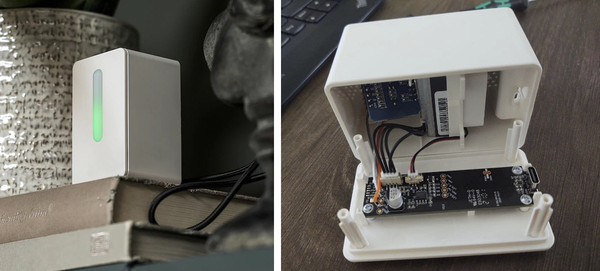
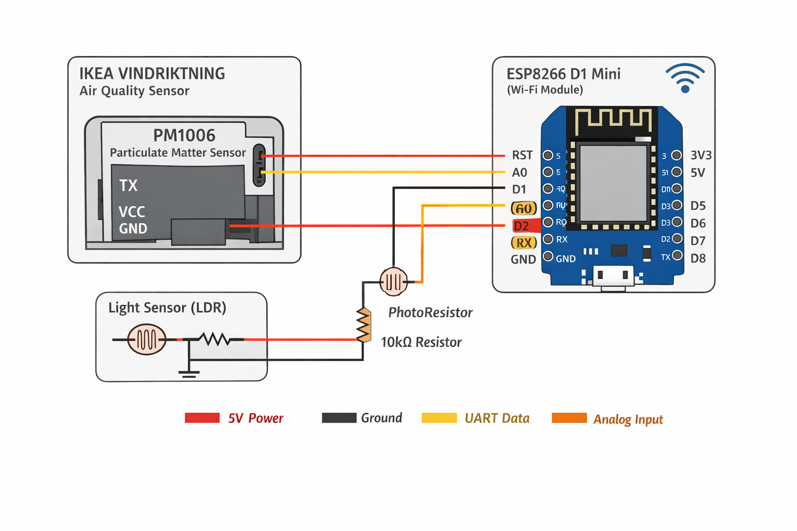
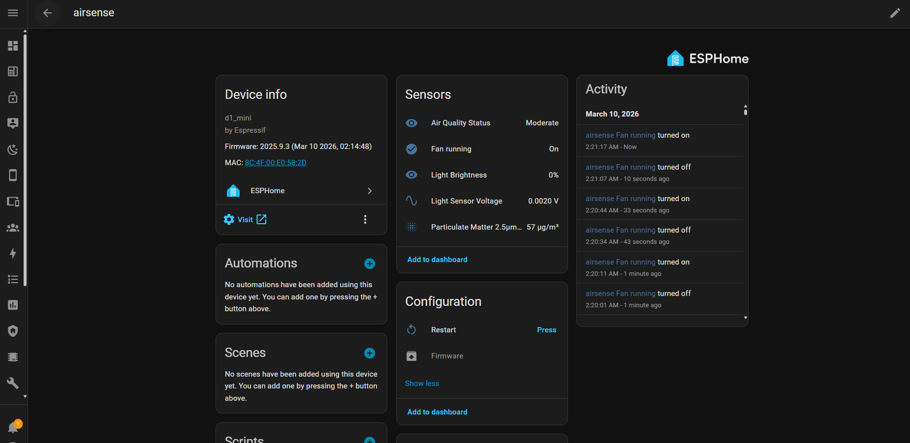

# AirSense – Hacked IKEA VINDRIKTNING Smart Air Monitor


AirSense is a modified version of the **IKEA VINDRIKTNING Air Quality Sensor** where the original hardware was reverse-engineered and upgraded with a **ESP8266 D1 Mini** running **ESPHome** to integrate it with **Home Assistant**.

Instead of the stock LED-only indicator, this project exposes detailed environmental data, device diagnostics, and remote controls through a smart home dashboard.

---

# Project Overview


The original IKEA device contains a **PM1006 particulate matter sensor** but only shows air quality using a colored LED.

This project taps into the sensor's **UART interface** and adds a WiFi-enabled microcontroller to expose the data digitally.

Additional monitoring and diagnostics features were implemented to make the device fully IoT-enabled.

---

# Hardware Hack



The IKEA unit was opened and the internal **PM1006 air quality sensor** UART output was connected to the ESP8266.

### Wiring

| PM1006 | ESP8266 |
| ------ | ------- |
| TX     | D2 (RX) |
| GND    | GND     |
| VCC    | 5V      |

An **LDR circuit** was added to measure ambient brightness.

---

# Internal Wiring



Inside the enclosure:

* ESP8266 D1 Mini mounted internally
* UART connection to PM1006 sensor
* LDR connected to A0
* Power tapped from device supply

---

# Home Assistant Dashboard



Once connected to **Home Assistant**, the device provides real-time monitoring:

* Air quality graphs
* Light brightness percentage
* Device health information
* WiFi diagnostics

---

# Features

### Air Quality Monitoring

* PM2.5 concentration
* Air quality classification

### Environmental Monitoring

* Ambient brightness detection
* Raw light sensor voltage

### Device Diagnostics

* WiFi signal strength
* Device uptime
* ESP8266 internal temperature
* Free memory monitoring

### Hardware Monitoring

* Fan activity detection
* Device online status

### Remote Control

* OTA firmware updates
* Restart control

---

# Sensors Exposed

| Sensor              | Description               |
| ------------------- | ------------------------- |
| PM2.5 Concentration | Air pollution level       |
| Air Quality Status  | Good / Moderate / Poor    |
| Light Voltage       | Raw LDR voltage           |
| Light Brightness    | Ambient brightness %      |
| WiFi Signal         | Network signal strength   |
| ESP Temperature     | Internal chip temperature |
| Free Heap           | Available memory          |
| Uptime              | Device runtime            |

Binary sensors:

| Sensor        | Description           |
| ------------- | --------------------- |
| Fan Running   | Detects fan operation |
| Device Status | Online / offline      |

---

# Possible Automations

Using **Home Assistant**:

* Turn on ventilation when PM2.5 rises
* Dim dashboards when room becomes dark
* Notify when air quality degrades
* Monitor device health remotely

---

# Future Improvements

* AQI calculation
* MQTT integration
* Local display dashboard
* Multi-room air quality mapping

---

# Author

Vipul Raj
IoT Developer | Hardware Hacker | Smart Home Enthusiast

---

# Resources

ESPHome Documentation
[https://esphome.io](https://esphome.io)

Home Assistant Documentation
[https://www.home-assistant.io](https://www.home-assistant.io)

---

## Suggested Image Folder Structure

```text
project/
 ├─ README.md
 └─ images/
      banner.jpg
      overview.jpg
      hardware_mod.jpg
      internal_wiring.jpg
      dashboard.jpg
```
